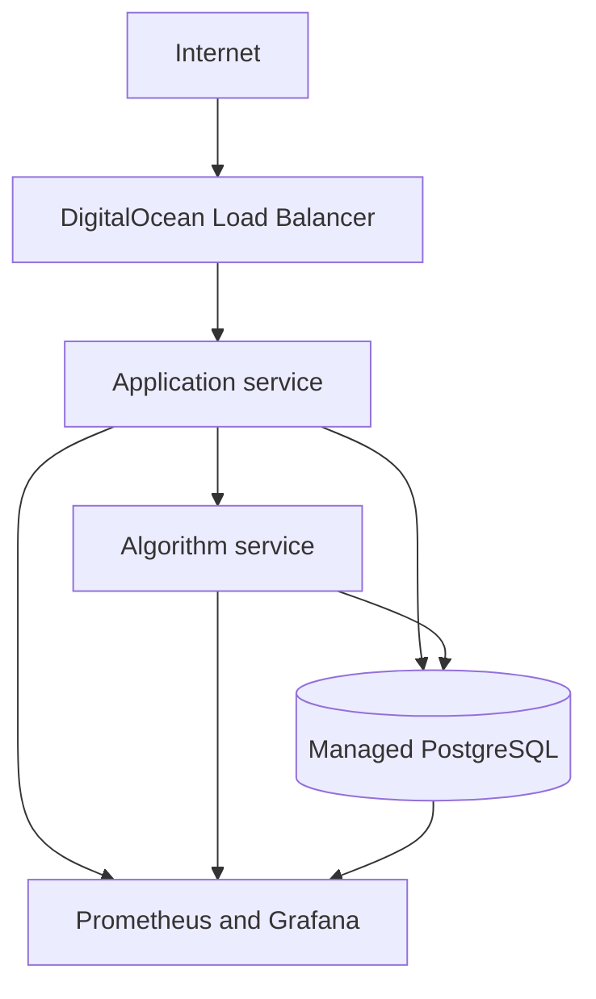

# DigitalOcean SaaS Infrastructure Blueprint

A production-minded reference architecture for operating a three-service B2B SaaS estate on DigitalOcean. It demonstrates how I structure infrastructure ownership: isolated environments, infrastructure as code, containerisation, observability, security checks, backup verification, controlled changes, and written runbooks.

> This is a reference implementation, not a drop-in production design. Network ranges, sizing, availability targets, data retention, recovery objectives, and promotion controls must be agreed after discovery. Production promotion remains with the client.

## Architecture



Each environment uses a separate Terraform state and variable file. Production changes are prepared through pull requests, reviewed and approved by the client, and applied by an authorised client-controlled promotion process.

## What this repository demonstrates

- Terraform-managed DigitalOcean VPC, firewall, load balancer, droplets, and managed PostgreSQL
- Separate test, staging, and production configurations
- Containerised algorithm service with health and metrics endpoints
- Local three-service topology using Docker Compose
- Prometheus and Grafana bootstrap configuration
- CI checks for Terraform, Docker, secrets, and vulnerabilities
- Scheduled drift detection without automatic production mutation
- Backup and restore verification workflow
- Change plan, rollback plan, incident, and architecture-decision templates
- Operational runbooks for patching, access, certificates, backups, and incidents

## Repository layout

| Path | Purpose |
|---|---|
| `infra/` | Reusable Terraform module and root configuration |
| `environments/` | Environment-specific, non-secret inputs |
| `services/algorithm/` | Example containerised algorithm workload |
| `monitoring/` | Prometheus and Grafana configuration |
| `.github/workflows/` | Validation, scanning, and drift detection |
| `scripts/` | Backup/restore verification and release helpers |
| `docs/runbooks/` | Recurring operational procedures |
| `docs/templates/` | Auditable change and incident templates |

## Quick start

Prerequisites: Docker Compose, Terraform 1.7+, and a DigitalOcean API token for infrastructure planning.

```bash
cp .env.example .env
docker compose up --build
curl http://localhost:8081/healthz
curl http://localhost:8081/metrics
```

Open Grafana at `http://localhost:3000` and Prometheus at `http://localhost:9090`.

To validate infrastructure without applying it:

```bash
terraform -chdir=infra init -backend=false
terraform -chdir=infra validate
terraform -chdir=infra plan -var-file=../environments/test/terraform.tfvars
```

## Change-control boundary

1. Engineer prepares a change record, implementation plan, test evidence, and rollback plan.
2. CI validates the change and produces a plan artifact.
3. Client reviews and approves the scheduled change.
4. Authorised client personnel promote to production.
5. Engineer validates service health, retains evidence, and updates the runbook or ADR.

No workflow in this repository automatically applies changes to production.

## Suggested first 90 days

- **Days 1–30:** inventory, threat and failure-mode review, monitoring baseline, access review, backup restore test, critical patching.
- **Days 31–60:** test/staging isolation, Terraform adoption, algorithm containerisation, CI validation and vulnerability evidence.
- **Days 61–90:** drift detection, SLO alerts, cost baseline, DR exercise, certificate automation, complete runbook set.

## Security notes

- No secrets are committed. Inject secrets through repository/environment secret stores.
- Administrative access is allow-listed and provisioned only after approval.
- The example listener uses HTTP so the blueprint can be validated without a real domain. Production must use an approved managed certificate and HTTPS listener, tracked through the certificate inventory runbook.
- Example defaults are intentionally conservative but must be replaced with an agreed hardening baseline.
- Database administration and application security remain outside this reference scope.

## Author

Rahul H Bhatia — DevOps / SRE / Platform Engineer
